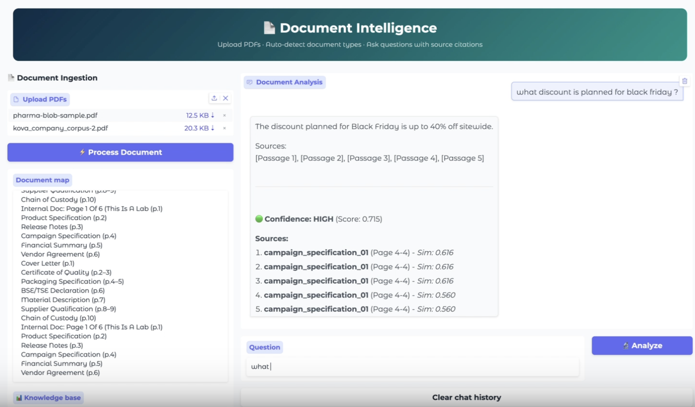

# 👋 Hi, I'm Ashok Maharjan

### Data Scientist | Machine Learning Practitioner | Deep Learning Enthusiast

I am a Data Scientist driven by the curiosity to uncover answers shrouded in data. With a background in scientific research, I realized that science wasn't just about generating data but unraveling the story hidden within it. I have since pivoted to computational data science, applying that same scientific rigor to solve complex biological and technical problems.

---
## 🏆 Featured Experience & Deployments

### **1. [📄 Multi-Document RAG Pipeline (Pfizer Externship)]**
*An AI pipeline that answers questions from messy pharmaceutical PDFs and cites its sources.*

> **"Real documents are a mess. The pipeline has to deal with that."**

* **The Challenge:** Pharmaceutical PDFs bundle five to ten unrelated documents into one file.
* **The Solution:** An adaptive RAG pipeline. Per-page OCR routing (pypdf first, Tesseract fallback), LLM page classification to detect document boundaries, chunks tagged with doc_id and page range, BGE-Small embeddings in a FAISS index, and Mistral-7B answering with citations or refusing when the context doesn't support an answer.
* **The Result:** 100% accuracy on the pharmaceutical test set. Every answer cites its source page, and the model refuses when the documents don't support an answer.

👇 **Click below to watch the demo:**

*([Click here to watch the full demo](https://www.loom.com/share/50154f762cd04cab8f7be9666ddf797e))*

## 🏆 Featured Experience & Deployments

### **2. [🎵 Music Genre Classification (Cuetessa Externship)]**
*Deep Learning work designed to categorize audio tracks for recommendation engines.*

> **"Bridging the gap between raw audio data and user experience."**

* **The Challenge:** Build a Deep Learning model to classify music genres from raw audio files.
* **The Solution:** Developed a Convolutional Neural Network (CNN) using TensorFlow/Keras that processes audio spectrograms.
* **The Result:** Achieved high-accuracy classification and presented technical findings to stakeholders.

👇 **Click below to watch the technical breakdown:**

*([Click here to watch the full presentation clip](https://youtu.be/JqZ7UVsmHHU))*

 

---
## 🧬 Biology + Machine Learning

| Project | Description & Key Tech | Link |
| :--- | :--- | :---: |
| **Protein Function Prediction** | **Scientific Goal:** Annotate uncharacterized proteins. Predicted GO terms from raw sequence using a protein language model, reaching **test auPRC 0.618** on CAFA5. 🛠 *ESM2-650M, PyTorch, Hugging Face* | [View](https://github.com/ashokvin77/protein-lm-function) |
| **Somatic Variant Calling** | **Scientific Goal:** Find cancer driver mutations. Tumor/normal pipeline on HCC1395 (chr17). Recovered **TP53 R175H at AF 0.987** against a truth-set value of 0.993. 🛠 *Snakemake, BWA, GATK MuTect2, SnpEff* | [View](https://github.com/ashokvin77/breast-cancer-variant-calling) |
| **COVID-19 scRNA-seq Reanalysis** | **Scientific Goal:** Characterize the immune response. Reanalyzed GSE150728 PBMCs. Found **interferon-stimulated genes up** and **MHC-II genes down** in COVID monocytes. 🛠 *Scanpy, DESeq2, Pseudobulk* | [View](https://github.com/ashokvin77/covid19-pbmc-scrnaseq-) |
| **Skin Lesion Classification** | **Scientific Goal:** Support dermoscopy triage. Multi-class CNN on ISIC images, reaching **72.1% test accuracy** and macro F1 0.699 across imbalanced classes. 🛠 *ConvNeXt-Tiny, PyTorch, Transfer Learning* | [View](https://github.com/ashokvin77/skin-cancer-classification) |

## 📂 Machine Learning & Analytics

| Project | Description & Key Tech | Link |
| :--- | :--- | :---: |
| **Telecom Churn Prediction** | **Business Goal:** Improve customer retention. Predicted churn with **0.87 ROC-AUC**. Handled class imbalance using upsampling/downsampling. 🛠 *CatBoost, Scikit-learn, Pipelines* | [View](https://github.com/ashokvin77/Telecom_Churn_Prediction) |
| **Computer Vision: Age Estimation** | **Business Goal:** Regulatory compliance. Built a ResNet50-based CNN model to estimate age from facial images with low MAE. 🛠 *Keras, Computer Vision, GPU* | [View](https://github.com/ashokvin77/Computer_Visions) |
| **IMDb Movie Review Classification** | **Business Goal:** Sentiment analysis. Created an NLP model to classify review sentiment, achieving **F1 Score ≥ 0.85**. 🛠 *BERT, NLTK, TF-IDF* | [View](https://github.com/ashokvin77/ML_Texts) |
| **Time Series Taxi Demand** | **Business Goal:** Optimize fleet management. Forecasted hourly taxi demand using historical data to predict peak times. 🛠 *Statsmodels, Prophet, Time Series* | [View](https://github.com/ashokvin77/Time_series_forecasting) |
| **Insurance Data Privacy** | **Business Goal:** Data masking & prediction. Solved customer similarity and prediction problems using matrix operations and obfuscation. 🛠 *Linear Algebra, Clustering* | [View](https://github.com/ashokvin77/Insurance-ML-Linear-Algebra) |
| **Gold Recovery Analysis** | **Business Goal:** Optimize production. Simulated industrial gold recovery process to predict efficiency using sensor data. 🛠 *EDA, Linear Regression* | [View](https://github.com/ashokvin77/Industrial_Gold_Recovery_Analysis) |
| **Oil Well Profit Prediction** | **Business Goal:** Risk assessment. Utilized **Bootstrapping** and risk analysis to select the most profitable region for drilling. 🛠 *Bootstrap, Risk Analysis, Scipy* | [View](https://github.com/ashokvin77/oil_well_profit_prediction) |
| **Instacart Market Analysis** | **Business Goal:** Consumer behavior insights. Exploratory data analysis of 3M+ orders to uncover purchasing patterns. 🛠 *Pandas, Matplotlib, Business Insights* | [View](https://github.com/ashokvin77/Instacart_Data_Analysis) |
| **Statistical Data Analysis** | **Business Goal:** Revenue comparison. Conducted hypothesis testing to compare revenue between two mobile plans. 🛠 *Statistics, Hypothesis Testing* | [View](https://github.com/ashokvin77/Statistical_Data_Analysis) |
| **Bank Customer Churn** | **Business Goal:** Customer loyalty. Predicted bank client churn using supervised learning models optimized for F1 score. 🛠 *Supervised Learning, Data Cleaning* | [View](https://github.com/ashokvin77/Supervised-Learning) |
| **Mobile Plan Recommendation** | **Business Goal:** Upselling strategy. Built a classification model to suggest the best mobile plan based on usage behavior. 🛠 *Classification, Accuracy Optimization* | [View](https://github.com/ashokvin77/Machine_learning_mobile_recommendation_model) |
| **Ride Sharing SQL Analysis** | **Business Goal:** Market analysis. Exploratory analysis on ride durations and popular locations in Chicago. 🛠 *SQL, Seaborn, Correlation Analysis* | [View](https://github.com/ashokvin77/sql_ride_sharing) |
| **Video Game Success Analysis** | **Business Goal:** Advertising strategy. Explored key factors in video game success to inform marketing budgets. 🛠 *EDA, Pandas, Trend Analysis* | [View](https://github.com/ashokvin77/Video_games) |
| **Car Advertisement App** | **Business Goal:** Interactive visualization. Deployed a **Streamlit** dashboard visualizing trends in US used vehicle market data. 🛠 *Streamlit, Plotly, Web Deployment* | [View](https://github.com/ashokvin77/Car_advertisement) |
| **Diabetes Health Indicators** | **Business Goal:** Population health screening. Predicted diabetes risk from BRFSS survey data, handling severe class imbalance across 250K+ records. 🛠 *Scikit-learn, Imbalanced Classification, EDA* | [View](https://github.com/ashokvin77/diabetes-health-indicators-ML) |

---

## 📫 Let’s Connect

I am open to collaboration on projects related to **Data Science**, **Machine Learning**, and **Analytics**.

* 📊 **Tableau Portfolio:** [See my Visualizations](https://public.tableau.com/app/profile/ashok.maharjan/vizzes)
* 💼 **LinkedIn:** [ashok-maharjan-ds](https://www.linkedin.com/in/ashok-maharjan-ds)
* 📧 **Email:** [ashokvin77@gmail.com](mailto:ashokvin77@gmail.com)
